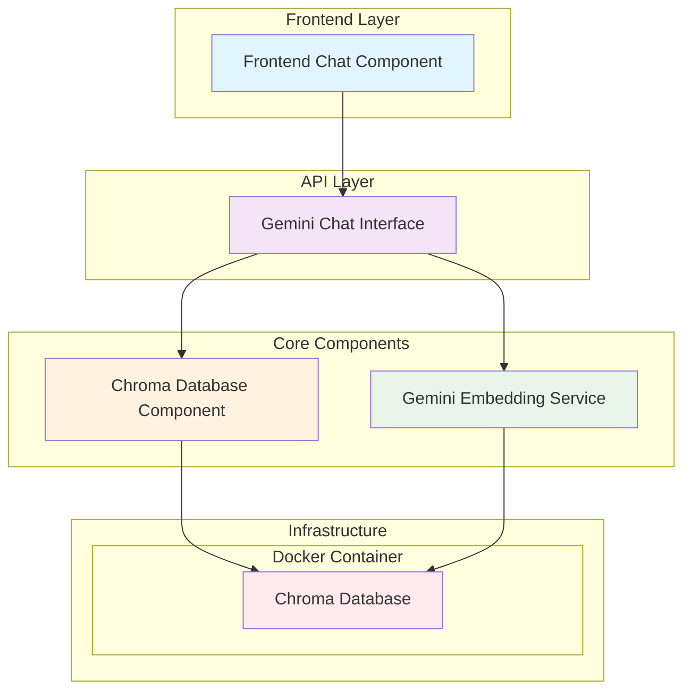
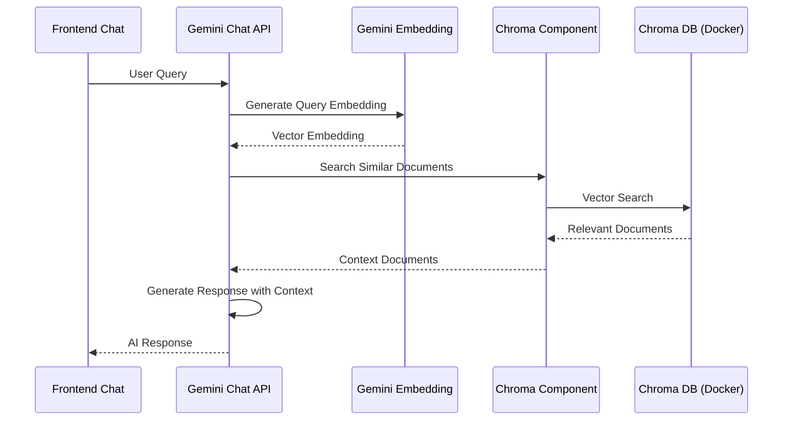

# Chroma RAG Solution

Ein Python-basiertes RAG (Retrieval-Augmented Generation) System mit modularer Architektur, das Chroma als Vektordatenbank und Google Gemini für Embeddings und Chat-Funktionalität nutzt.

## 📋 Projektübersicht

Dieses Projekt implementiert eine modulare RAG-Lösung mit getrennten, wiederverwendbaren Komponenten. Die Architektur ermöglicht eine klare Trennung der Verantwortlichkeiten und eine einfache Erweiterung einzelner Funktionalitäten.

## 🏗️ Architektur

Das System besteht aus folgenden Hauptkomponenten:

### Komponenten-Übersicht



### Datenfluss



## 📦 Geplante Modulstruktur

```
chroma-rag-solution/
├── src/
│   ├── __init__.py
│   ├── components/
│   │   ├── __init__.py
│   │   ├── chroma_component.py      # Chroma Database Interface
│   │   ├── gemini_embedding.py      # Gemini Embedding Service
│   │   ├── gemini_chat.py          # Gemini Chat API Interface
│   │   └── frontend_chat.py        # Frontend Chat Component
│   ├── config/
│   │   ├── __init__.py
│   │   └── settings.py             # Konfiguration und Umgebungsvariablen
│   └── utils/
│       ├── __init__.py
│       └── helpers.py              # Hilfsfunktionen
├── docker/
│   └── docker-compose.yml          # Chroma Database Container
├── tests/
│   ├── __init__.py
│   ├── test_chroma_component.py
│   ├── test_gemini_embedding.py
│   ├── test_gemini_chat.py
│   └── test_integration.py
├── docs/
│   └── api.md                      # API Dokumentation
├── requirements.txt
├── pyproject.toml
├── .env.example                    # Beispiel Umgebungsvariablen
└── README.md
```

## 🔧 Komponenten-Details

### 1. Chroma Database Component (`chroma_component.py`)

- **Zweck**: Abstraktionsschicht für Chroma-Datenbankoperationen
- **Funktionalitäten**:
  - Verbindung zur lokalen Chroma-Instanz (Docker)
  - Dokumente hinzufügen, aktualisieren, löschen
  - Vektorsuche und Ähnlichkeitsabfragen
  - Collection-Management

### 2. Gemini Embedding Service (`gemini_embedding.py`)

- **Zweck**: Text-zu-Vektor-Transformation mit Google Gemini
- **Funktionalitäten**:
  - Text-Embeddings generieren
  - Batch-Verarbeitung für mehrere Dokumente
  - Embedding-Modell-Konfiguration
  - Rate-Limiting und Fehlerbehandlung

### 3. Gemini Chat Interface (`gemini_chat.py`)

- **Zweck**: Chat-API mit RAG-Integration
- **Funktionalitäten**:
  - Benutzeranfragen verarbeiten
  - Relevante Kontextdokumente abrufen
  - Antworten mit Kontext generieren
  - Chat-History verwalten

### 4. Frontend Chat Component (`frontend_chat.py`)

- **Zweck**: Benutzeroberfläche für Chat-Interaktionen
- **Funktionalitäten**:
  - RESTful API für Frontend-Integration
  - WebSocket-Unterstützung für Real-time Chat
  - Session-Management
  - Response-Streaming

## 🐳 Infrastructure

### Chroma Database (Docker)

- Lokale Chroma-Instanz läuft in Docker-Container (Chroma API v2)
- Persistente Datenspeicherung
- Konfigurierbare Ports und Volumes
- Health-Checks und Restart-Policies

## 🔑 Umgebungsvariablen

```env
# Gemini API
GOOGLE_API_KEY=your_gemini_api_key

# Chroma Database
CHROMA_HOST=localhost
CHROMA_PORT=8000
CHROMA_COLLECTION_NAME=documents

# Chat Configuration
CHAT_MODEL=gemini-2.5-flash
EMBEDDING_MODEL=text-embedding-004
MAX_TOKENS=2048
TEMPERATURE=0.7
# Gemini Embedding Tuning
GEMINI_REQUEST_TIMEOUT=60
GEMINI_MAX_RETRIES=3
GEMINI_RETRY_BACKOFF_SECONDS=2
```

## 🚀 Geplante Features

- [ ] Modulare Architektur mit klarer Trennung
- [ ] Docker-basierte Chroma-Datenbank
- [ ] Gemini-Integration für Embeddings und Chat
- [ ] RESTful API für Frontend-Integration
- [ ] WebSocket-Support für Real-time Chat
- [ ] Umfassende Fehlerbehandlung und Logging
- [ ] Unit- und Integrationstests
- [ ] Konfigurierbare Modelle und Parameter
- [ ] Dokumenten-Upload und -Management
- [ ] Chat-History und Session-Management

## 📚 Technologie-Stack

- **Python 3.11+**: Hauptprogrammiersprache
- **Chroma**: Vektordatenbank für Embeddings
- **Google Gemini**: LLM für Embeddings und Chat
- **Docker**: Containerisierung der Chroma-Datenbank
- **FastAPI**: Web-Framework für API-Endpunkte
- **Pydantic**: Datenvalidierung und -serialisierung
- **pytest**: Testing-Framework

## 📖 Nächste Schritte

1. **Environment Setup**: Virtuelle Umgebung und Abhängigkeiten
2. **Docker Configuration**: Chroma-Container Setup
3. **Core Components**: Implementierung der Basis-Komponenten
4. **API Development**: RESTful Endpunkte erstellen
5. **Testing**: Unit- und Integrationstests
6. **Documentation**: API-Dokumentation und Beispiele

---

> **Hinweis**: Diese README beschreibt die geplante Architektur. Die Implementierung erfolgt schrittweise nach Bestätigung der Strukturvorgaben.
